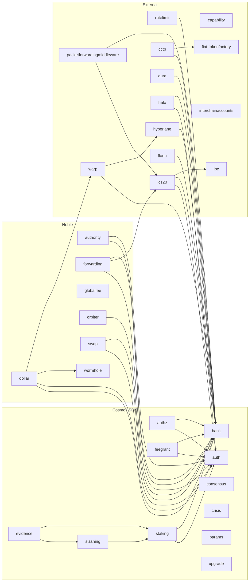

# Dependencies

This document provides a visual representation of the Noble blockchain's modular architecture
and the dependencies between its various components.

## Module Dependency Graph

The diagram below shows the modules composing the Noble Core chain and their dependencies graph.
The modules are organized into three main categories:

- **Cosmos SDK**: Standard blockchain modules from the Cosmos SDK framework
- **Noble**: Custom modules specific to Noble's functionality
- **External**: Third-party modules integrated into Noble

Each arrow represents a dependency relationship, showing how modules depend on each other for functionality.

