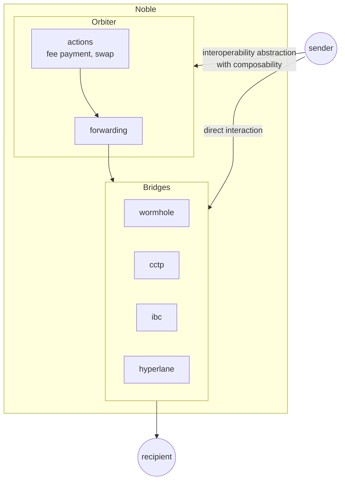
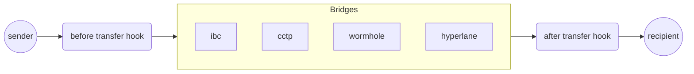

# Interoperability

This document illustrates Noble's interoperability architecture, showing how the chain
facilitates cross-chain interactions through multiple bridging protocols and abstraction layers.

## Noble's Complete Interoperability Stack

The first diagram shows Noble's entire interoperability architecture. Noble provides a comprehensive
interop stack that includes multiple bridge protocols and the Orbiter abstraction layer:

- **Bridge Protocols**: Direct access to various bridging solutions (IBC, CCTP, Hyperlane, Wormhole).
- **Orbiter**: Provides composable operations (actions like fee payment and swapping)
  combined with forwarding capabilities.
- **Dual Access Patterns**: Users can either leverage Orbiter for enhanced composability
  or interact directly with bridges

This architecture gives users flexibility since they can use Orbiter for complex workflows
or bypass it for simple transfers.

## Orbiter's Hook-Based Architecture

The second diagram shows how Orbiter specifically implements programmable transfer hooks.
This is the core mechanism that enables Orbiter's composability features:

- **Before Transfer Hook**: Executes custom logic (fee payment, swapping, etc.) before
  initiating the bridge transfer.
- **After Transfer Hook**: Handles post-transfer logic.
- **Bridge Integration**: Works seamlessly with all supported bridge protocols.

This hook system is what allows Orbiter to provide a unified interface for complex
cross-chain operations that would otherwise require multiple separate transactions.

