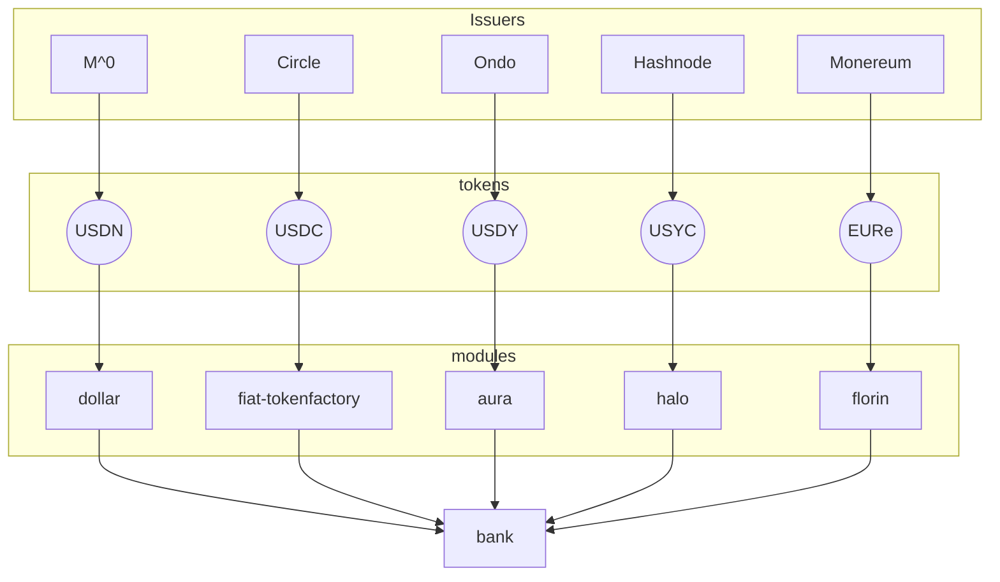

# Issuance

This document shows the token issuance ecosystem on Noble, illustrating the relationship
between issuers, tokens, and the Noble modules that manage them.

## Token Issuance Flow

The diagram below shows how various issuers deploy different tokens on Noble and which
specialized modules manage each token type:

- **Issuers**: Real-world entities that mint and manage stablecoins.

- **Tokens**: The actual digital assets issued (USDC, USDN, EURe, etc.).

- **Modules**: Noble's specialized modules that handle the on-chain logic for each token type.

All token modules ultimately interact with the Cosmos SDK `bank` module for core token
functionality like transfers and balances.

