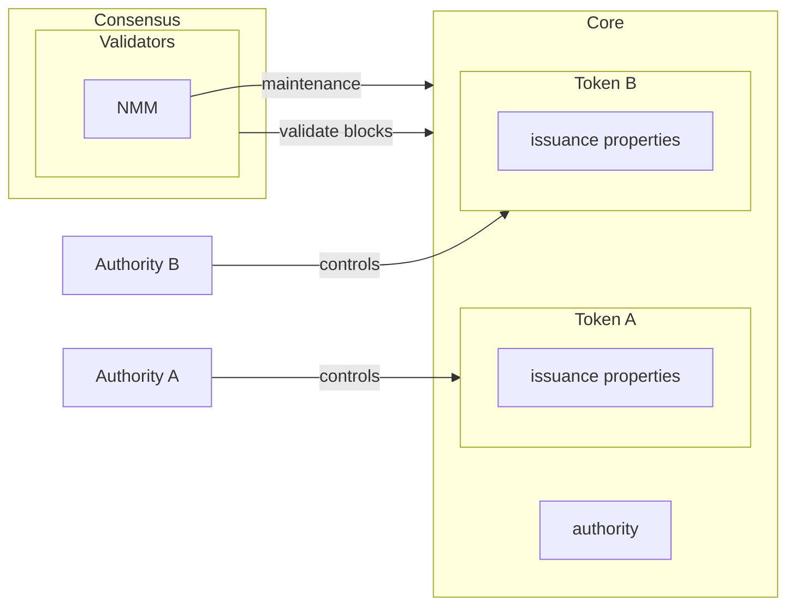

# Security

This document outlines Noble's security architecture at different layers of the blockchain stack.

## Generic Security Architecture

The first diagram shows Noble's overall security model, illustrating the separation between
consensus, core protocol, and application layers:

## Token Issuance Security

The second diagram focuses specifically on token issuance security, showing how different authorities control different tokens while validators secure the overall network:

