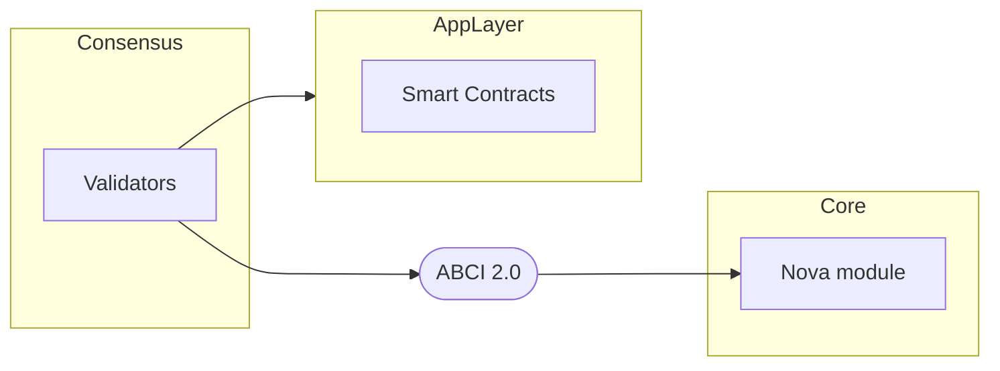
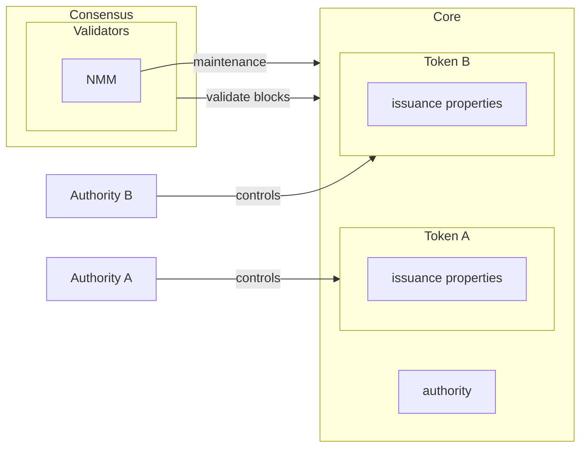

# Security

This document outlines Noble's security architecture at different layers of the blockchain stack.
Noble implements a multi-layered security model that ensures the integrity and safety of token
operations, consensus mechanisms, and cross-chain interactions.

## Security Principles

Noble's security model is built on two key principles:

- **Separation of Concerns**: Different layers handle specific security responsibilities
- **Least Privilege**: Each component has minimal necessary permissions

## Generic Security Architecture

Noble's security architecture is designed with clear separation between consensus, core protocol,
and application layers. This layered approach ensures that security vulnerabilities in one
layer don't compromise the entire system.

### Layer Responsibilities

- **Consensus Layer**: Validators secure the network through Byzantine Fault Tolerant consensus,
  ensuring block instant finality and network integrity
- **Core Protocol Layer**: The core layer is responsible for minimal and basic operations. The two
  most important are token issuance and cross-chain data transfer.
- **Application Layer**: Smart contracts and dApps operate on a separate environment from the Core.
  This layer runs an EVM sequencer instance and communicate with Core via the Nova module.

The following diagram illustrates these security boundaries:

## Token Issuance Security

The second diagram focuses specifically on token issuance security, showing how different
authorities control different tokens while validators secure the overall network:

